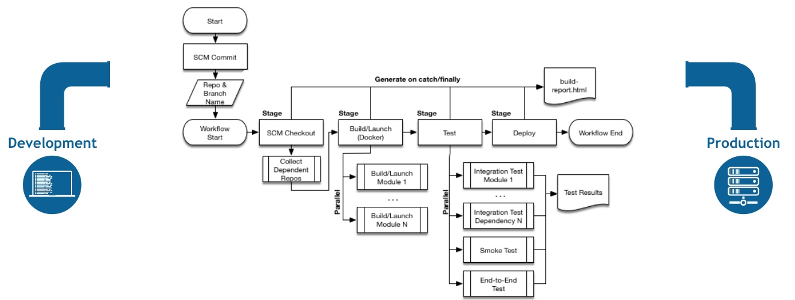

# ABOUT_JENKINS2.0_WITH_PIPELINE

## Jenkins2.0
### 概述
自从去年9月底Jenkins的创始人Kohsuke Kawaguchi提出Jenkins 2.0（后称2.0）的愿景和草案之后，整个Jenkins社区为之欢欣鼓舞，不管是官方博客还是Google论坛，大家都在热烈讨论和期盼2.0的到来。4月20日，历经Alpha(2/29)，Beta(3/24)，RC(4/7)3个版本的迭代，2.0终于正式发布。这也是Jenkins面世11年以来（算上前身Hudson）的首次大版本升级。那么，这次升级具体包含了哪些内容呢？

- 外部特点
    - Pipeline as Code
    - 全新的开箱体验
    - 1.x兼容性。
- 内部特性
    - 升级Servlet版本到3.1，获取Web Sockets支持
    - 升级内嵌的Groovy版本到2.4.6
    - 提供一个简化的JS类库给Plugin开发者使用
  
  
## Pipeline 

### 基本概念
- Stage：一个Pipeline可以划分为若干个Stage，每个Stage代表一组操作。注意，Stage是一个逻辑分组的概念，可以跨多个Node。
- Node：一个Node就是一个Jenkins节点，或者是Master，或者是Agent，是执行Step的具体运行期环境。
- Step：Step是最基本的操作单元，小到创建一个目录，大到构建一个Docker镜像，由各类Jenkins Plugin提供。
  
### 功能清单
  
| 命令 | 功能 | 示例  |
| --- | --- | --- |
| input | 弹出和用户交互的输入表单 |input id: 'Environment_id', message: 'Custome your parameters', ok: '提交', parameters: getInputParam(project)  |
| readFile | 读取文件 | readFile encoding: 'utf-8', file: 'data.zip' |
| git | git操作 | git credentialsId: 'jenkinsfile', url: 'git@xxxxxxxx:infra/jenkins-pipeline.git' |
| stash | 暂存文件 | stash name: "id_rsa", includes: "id_rsa" |
| unstash | 获取暂存文件 | unstash "id_rsa" |
| writeFile | 写入文件 | writeFile(file: 'data.zip', text: paramMap.inspect(), encoding: 'utf-8')  |
| parallel | 并行运行 |   |
[更多参见](http://10.141.4.83:18083/job/yrd-environment-build/pipeline-syntax/html)
### 原理
- PIPELINE工作流程图

### 参考资料
- [Pipeline-plugin](https://github.com/jenkinsci/pipeline-plugin)
- [pipeline-examples](https://github.com/jenkinsci/pipeline-examples)
-  [Pipeline+Stage+View+Plugin](https://wiki.jenkins-ci.org/display/JENKINS/Pipeline+Stage+View+Plugin)
  
  

